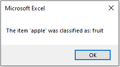

# ClassifyTypeWithGPT
The ClassifyTypeWithGPT function is a VBA function that uses the OpenAI GPT API to classify an input into one of several predefined outputs.

## Requirements
1. An API key from OpenAI. You can sign up and generate one from OpenAI [here](https://beta.openai.com/signup/).
2. VBA-JSON library found on [GitHub](https://github.com/VBA-tools/VBA-JSON).

## Installation
1. Download the ClassifyTypeWithGPT.bas file from this repository.
2. Import the ClassifyTypeWithGPT.bas file into your VBA project.
3. In your VBA code, call the ClassifyTypeWithGPT function with the required parameters.

## Usage
To use the ClassifyTypeWithGPT function, you will need to provide the following parameters:

- inputValue - The value to be identified.
- outputOptions() - An array of possible types the value could be classified as.
- apikey - Your OpenAI API key.

Optional:
- modelName - An OpenAI API model name.

**Note**: If a modelName is not entered, the default GPT model **'gpt-3.5-turbo'** will be used

<br>

Example:
```vb
Sub ExampleMacro()

    Dim inputValue As String
    Dim outputOptions(1) As String
    Dim apiKey As String
    Dim modelName As String
    Dim result As String
    
    inputValue = "apple"
    outputOptions(0) = "fruit"
    outputOptions(1) = "vegetable"
    apiKey = "your-api-key"
    modelName = "text-davinci-003"
    
    result = ClassifyTypeWithGPT(inputValue, outputOptions, apiKey, modelName)
    
    MsgBox "The item '" & inputValue & "' was classified as: " & result

End Sub
```

<br>

Output:



<br>

If GPT is unable to fit the inputValue into any of the provided options, it will return **'unknown'**:

.PNG)
